<div align="center">


# AdLedger

**The open-source Hyros. Know which ads actually make you money.**

Self-hosted ad attribution that joins **Meta & Google Ads spend**, **first-party website tracking**, **leads** and **Stripe revenue** — with AI insights you bring yourself and a built-in **MCP server** so Claude can answer *“which ads made money?”*

[Website](https://shubhamvankalas.github.io/adledger/) · [Quick start](#quick-start) · [Features](#features) · [Deploy](#deploy-anywhere) · [MCP](#ask-claude-about-your-ads-mcp) · [FAQ](docs/FAQ.md) · [Docs](docs/)

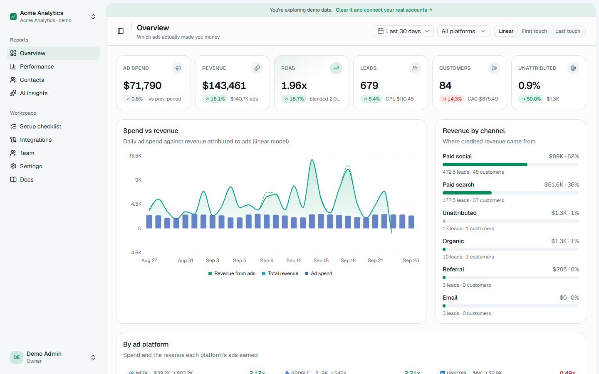

</div>

---

## Why

Ad platforms each take credit for the same sale, iOS privacy broke their pixels, and the tools that fix this (Hyros, Triple Whale, Cometly, Wicked Reports) cost $129–$2,500+/month — often priced as a cut of your revenue.

AdLedger does the core job for free, on your own server: every click, lead and payment in **one ledger**, so you can see real **ROAS, CAC and CPL per campaign, ad set and ad**.

> *“I spent $58k on ads last month. AdLedger shows Lookalike 1% returned 3.5x while Broad Interest returned 0.01x on $11k. The weekly note tells me to move budget from Broad to Lookalike and Retargeting.”*

## Quick start

You need [Docker](https://docs.docker.com/get-docker/). That's it.

```bash
git clone https://github.com/ShubhamVankalas/adledger.git
cd adledger
docker compose up -d
```

Open **http://localhost:3000**, create your account, and tick **“Start with demo data”** to explore 90 days of realistic Meta, Google Ads and Stripe data in under a minute.

**On a server with a domain (automatic HTTPS):**

```bash
curl -fsSL https://raw.githubusercontent.com/ShubhamVankalas/adledger/main/install.sh | DOMAIN=ads.yourcompany.com sh
```

**Without Docker** (Node 20+), using the built-in embedded database:

```bash
pnpm install && pnpm dev
```

## Screenshots

| Performance by campaign, ad set and ad | Customer journey and credit per model |
|---|---|
| 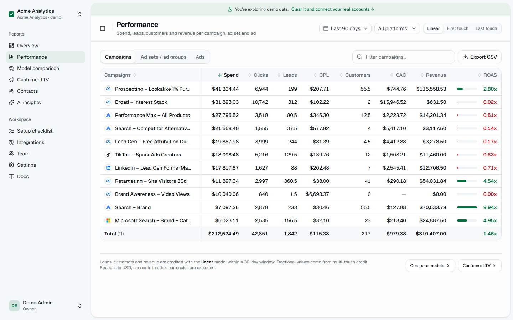 | 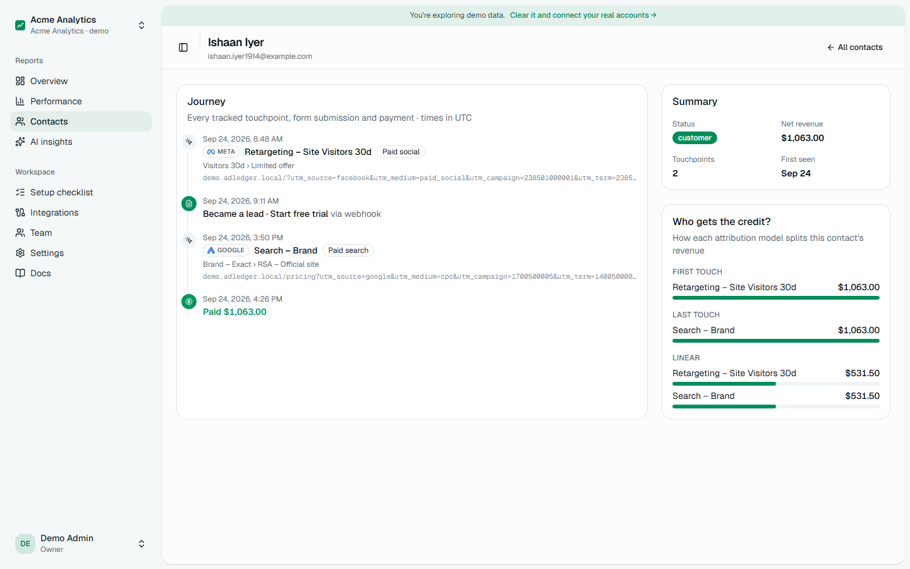 |
| **Weekly insights (bring your own model)** | **Dark mode** |
| 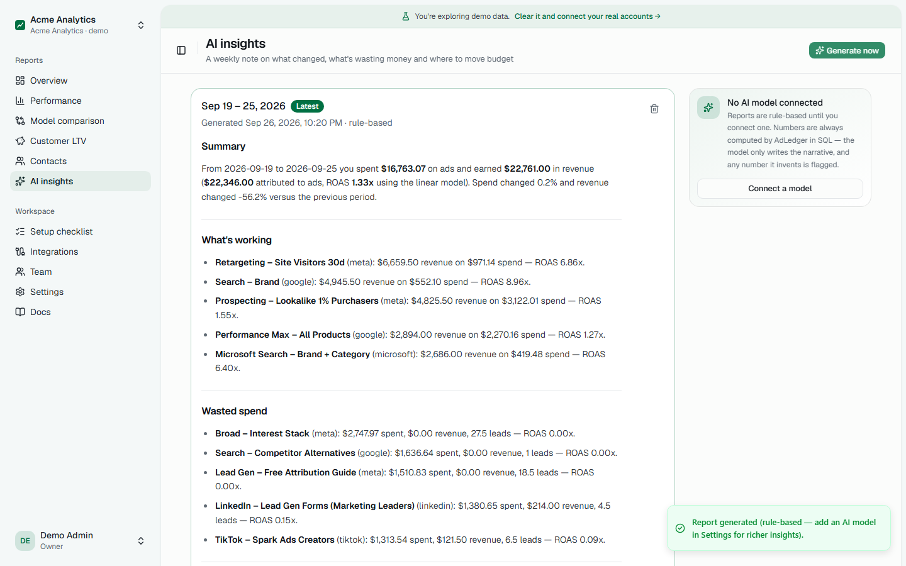 | 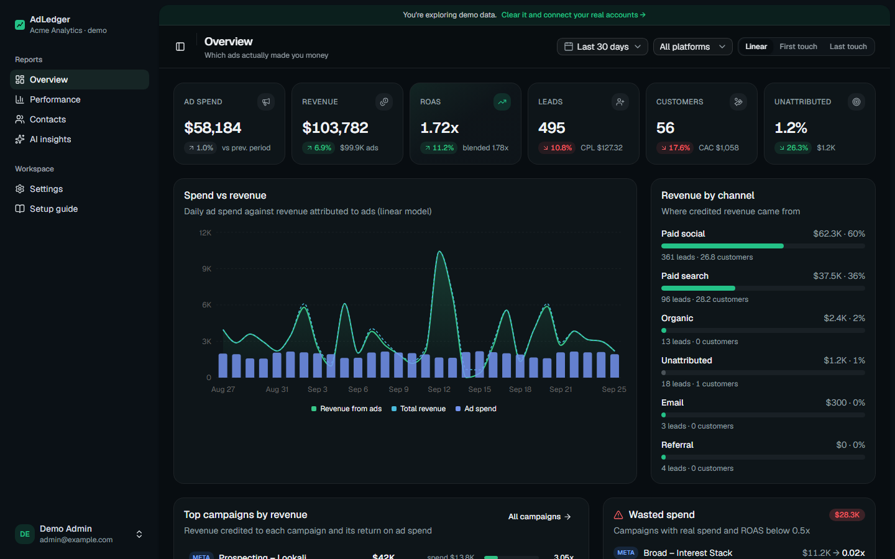 |
| **One-snippet tracking setup** | **Setup wizard** |
| 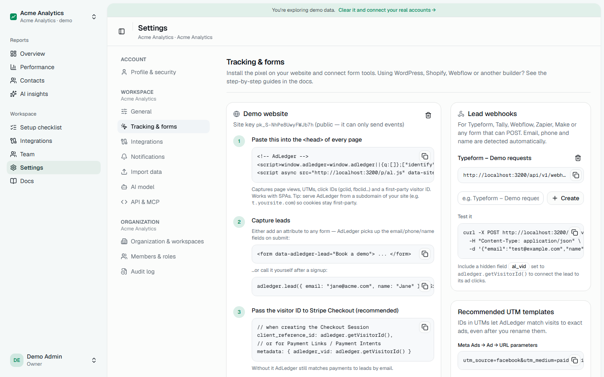 | 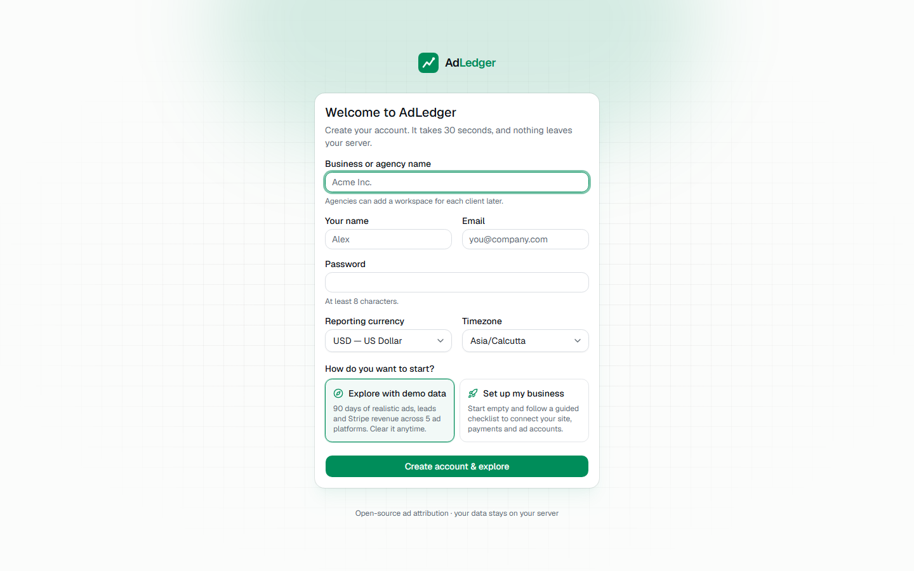 |
| **30+ integrations** | **Guided setup checklist** |
| 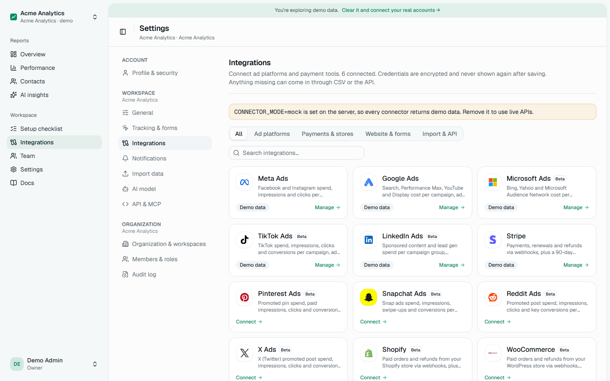 | 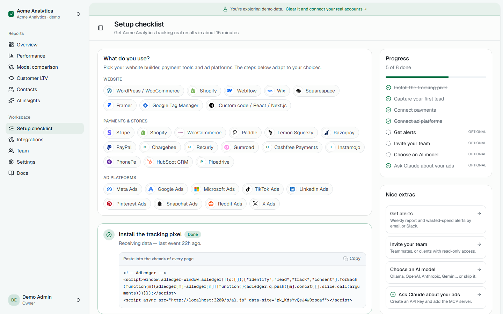 |
| **Teams, roles and client access** | **Alerts by email, Slack, Discord, Teams, SMS** |
| 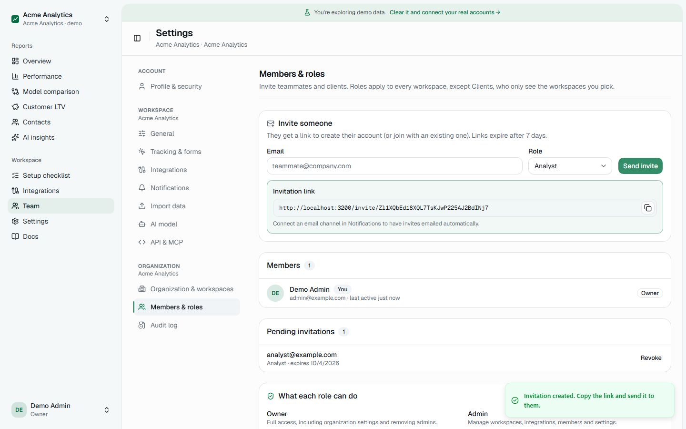 | 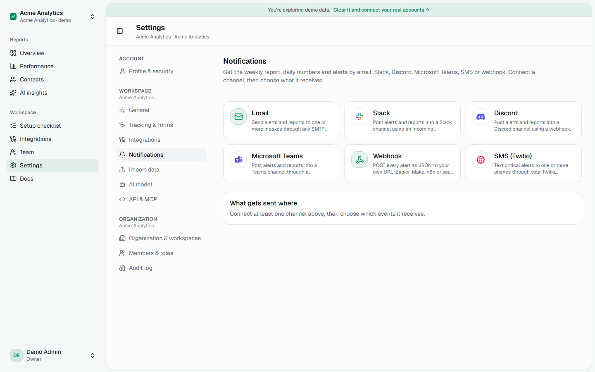 |

**On your phone** — installable as an app, with a bottom tab bar and a one-tap filter sheet:

<p>
  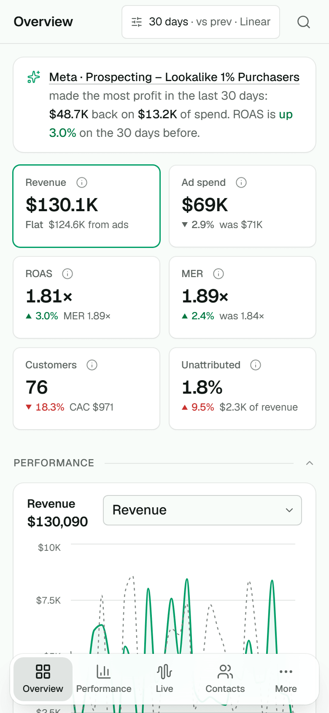
  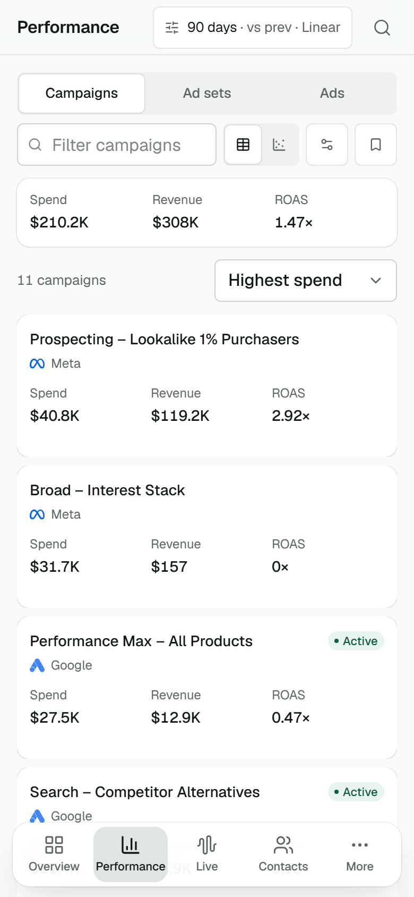
  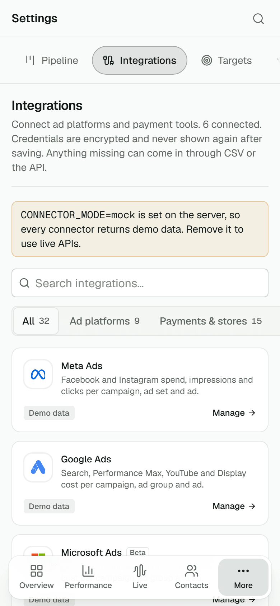
</p>

## Features

| | |
|---|---|
| **Ad spend sync** | **Meta, Google Ads, Microsoft Ads, TikTok, LinkedIn, Pinterest, Snapchat, Reddit and X** — daily spend, impressions and clicks per campaign, ad set and ad. Any other network via CSV or the Spend API. Re-syncs never duplicate. |
| **First-party pixel** | One `<script>` tag (**2.4 KB** gzipped). Page views, UTMs, click IDs (`gclid`, `fbclid`, `gbraid`, `wbraid`, `ttclid`…), `_fbp`/`_fbc`, SPA support. Consent modes (opt-out, consent required, cookieless), Global Privacy Control, and ready-made glue for Cookiebot, CookieYes, Osano, Klaro and Google Consent Mode v2. |
| **Lead capture** | `data-adledger-lead` on any form, `adledger.lead()` in JS, or a webhook for Typeform, Tally, Webflow, Zapier… (fields auto-detected). **Native ad lead forms** from Meta Lead Ads, Google Ads lead forms and TikTok Lead Generation, credited to the exact ad. **WhatsApp click-to-chat** conversations as leads, linked to the ad click that opened the chat. **WordPress/WooCommerce plugin**, Shopify custom pixel and guides for Webflow, Wix, Squarespace, Framer and GTM. |
| **Revenue** | **Stripe, Shopify, WooCommerce, Paddle, Lemon Squeezy, Razorpay, PayPal, Chargebee, Recurly, Gumroad, Cashfree, Instamojo and PhonePe** via webhooks (Stripe: paste one key, the webhook is created for you). Won deals from **HubSpot** and **Pipedrive** for sales-led businesses. Anything else via CSV or the Conversions API. Refunds and renewals handled. |
| **Identity stitching** | Anonymous visitor → lead → customer, across devices, by email. |
| **Attribution** | First-touch, last-touch and linear — switch instantly. Exact revenue splits (integer cents, largest-remainder). LTV: renewals credit the journey that acquired the customer. Unattributed revenue is shown, never hidden. |
| **Dashboard** | A customizable Overview board (pin KPIs, drag widgets, presets for e-commerce, lead gen and agencies, a personal view or a team default), KPIs with period-over-period change and sparklines, a metric explorer, spend vs revenue chart, drill-down tables with CSV export, contact journeys, dark mode. Installable on your phone (PWA) with a bottom tab bar. **⌘K / Ctrl K** finds any page, setting, contact, campaign or ad; `G` then a letter jumps between pages and `?` lists every shortcut. |
| **AI insights (BYO model)** | Weekly note on what changed, wasted spend and where to move budget. Works with **Ollama / LM Studio (local, free)**, OpenAI, Anthropic, Gemini, OpenRouter, DeepSeek, or no AI at all. Every number is computed in SQL; invented numbers are flagged. |
| **MCP server** | Read-only tools for Claude, Cursor or any agent: overview, performance, wasted spend, period comparison, contact journeys (emails masked). |
| **Teams & agencies** | Organizations with many workspaces (one per brand or client), invitations, roles (Owner, Admin, Analyst, Viewer, Client) and an audit log. Clients see only their own workspace. |
| **Notifications** | Weekly report, daily digest, wasted-spend alerts, sync failures, new customers and large payments — by email, Slack, Discord, Microsoft Teams, SMS (Twilio) or signed webhook. |
| **Guided setup** | First run: explore a demo or set up your business with a checklist that ticks itself off as data arrives. |
| **Demo mode** | Realistic mock connectors for every integration — the whole app works with zero API access. |

## How it compares

| | **AdLedger** | Hyros | Triple Whale | Cometly |
|---|---|---|---|---|
| Price | **Free (AGPL)** | Paid, scales with revenue tracked | Paid, scales with GMV | Paid subscription |
| Self-hosted / own your data | **Yes** | No | No | No |
| Ad platforms | 9 native + CSV/API | Many | Many | Many |
| First-party pixel + click IDs | Yes | Yes | Yes | Yes |
| Payment sources | 13 native + CRM deals + CSV/API | Many | Shopify-first | Many |
| Teams, roles, client access | **Yes, unlimited seats** | Paid tiers | Paid tiers | Paid tiers |
| Multi-touch models | First, last, linear | Many | Many | Many |
| Conversions API upload to ad platforms | Beta (Meta CAPI, Google Ads) | Yes | Yes | Yes |
| AI with your own model | **Yes (incl. local)** | No | Proprietary | Proprietary |
| MCP server for AI agents | **Yes** | No | No | No |

*Based on public information at the time of writing; check each vendor for current features and pricing.*

## Deploy anywhere

| Where | How |
|---|---|
| **Any Linux server / VPS** | `install.sh` above (Docker + Postgres + optional Caddy HTTPS). ~1 GB RAM is plenty. |
| **Your laptop** | `docker compose up -d` |
| **Render** | Uses [`render.yaml`](render.yaml): web service + managed Postgres. |
| **Railway / Coolify / Dokploy / CapRover** | Deploy the `Dockerfile`, add a Postgres, set `DATABASE_URL`. |
| **Single container, no Postgres** | `docker run -p 3000:3000 -v adledger:/data ghcr.io/shubhamvankalas/adledger` (embedded database — great for trying it; use Postgres for production). |

Upgrading: `docker compose pull && docker compose up -d`. Database migrations run automatically on start. Full guide: [docs/SELF_HOSTING.md](docs/SELF_HOSTING.md).

## Connect your data

Everything is configured in the app — no config files. After signing up choose **Set up my business** and follow the **setup checklist**:

1. **Install the pixel** — paste one snippet (or use the [WordPress plugin](integrations/wordpress), [Shopify pixel](integrations/shopify), or a [guide for your site builder](docs/integrations/)).
2. **Connect payments** — Stripe (just paste a key), Shopify, WooCommerce, Paddle, Lemon Squeezy, Razorpay, PayPal, Chargebee, Recurly, Gumroad, Cashfree, Instamojo, PhonePe, or won deals from HubSpot / Pipedrive — or CSV / API.
3. **Connect lead sources** (optional) — Meta Lead Ads, Google Ads lead forms, TikTok Lead Generation and WhatsApp Business, for leads that never reach your website.
4. **Connect ad platforms** — Meta, Google, Microsoft, TikTok, LinkedIn, Pinterest, Snapchat, Reddit, X — or CSV / API for any other network.
5. **Optional:** alerts (email, Slack…), invite your team, pick an AI model, add the MCP server.

Step-by-step instructions are on each integration card and in [docs/CONNECTORS.md](docs/CONNECTORS.md). You can try every integration without an account — the demo workspace uses realistic mock data.

Use IDs in your UTMs so AdLedger can match visits to exact ads:

```
Meta:   utm_source=facebook&utm_medium=paid_social&utm_campaign={{campaign.id}}&utm_term={{adset.id}}&utm_content={{ad.id}}
Google: utm_source=google&utm_medium=cpc&utm_campaign={campaignid}&utm_term={adgroupid}&utm_content={creative}
```

## Ask Claude about your ads (MCP)

Create an API key in **Settings → API & MCP**, then:

```bash
claude mcp add --transport http adledger https://your-adledger/api/mcp --header "Authorization: Bearer al_..."
```

> **You:** Which campaigns made money last month and which wasted spend?
> **Claude:** *(calls `get_performance` and `find_wasted_spend`)* Lookalike 1% returned 3.47x on $13.7k and Brand search 12.98x…

Tools: `get_overview`, `get_performance`, `find_wasted_spend`, `compare_periods`, `get_platform_breakdown`, `get_timeseries`, `search_campaigns`, `list_contacts`, `get_contact_journey`, `get_latest_insights`, `get_sync_status`, `list_integrations` — all read-only. Claude Desktop and Cursor configs are in [docs/MCP.md](docs/MCP.md).

The REST API is described by an OpenAPI 3.1 spec served at `/api/v1/openapi.json`; see [docs/API.md](docs/API.md).

## Architecture

One Next.js app + PostgreSQL. The dashboard, REST API, pixel endpoint, webhooks, MCP server and background jobs (syncs, attribution, weekly reports) all run in a single container.

```
 your website ──al.js──▶ /api/v1/collect ─┐
 form tools ──webhook──▶ /api/v1/webhooks ┤          ┌──────────────┐
 Stripe ─────webhook──▶ /api/v1/webhooks ─┼──▶ AdLedger app ──▶│ PostgreSQL 16│
 Meta / Google Ads ◀── scheduled sync ────┤  (Next.js)   └──────────────┘
 Claude / Cursor ──MCP──▶ /api/mcp ───────┘   ▲ dashboard (browser)
```

Stack: Next.js 16 · TypeScript · PostgreSQL (Drizzle ORM) · Tailwind + shadcn/ui · Recharts · Vercel AI SDK · MCP SDK. Details in [docs/ARCHITECTURE.md](docs/ARCHITECTURE.md).

## Privacy & security

- Raw emails are stored only in `contacts`; everywhere else emails/phones are SHA-256 hashed (lowercased, trimmed — the format Meta CAPI / Google Enhanced Conversions expect).
- IPs are truncated before storage. The pixel honors `adledger.consent(false)`, Global Privacy Control and optional Do-Not-Track, and can wait for consent before storing or sending anything (`data-consent="required"`, for EU and UK visitors). Its cookie lasts 13 months.
- Conversions sent back to Meta and Google carry consent signals (Google `adUserData`/`adPersonalization`, Meta Limited Data Use for GPC visitors); people who said no are never uploaded.
- Connector credentials are encrypted at rest (AES-256-GCM) and never shown again.
- API keys and sessions are stored hashed. The MCP server is read-only.
- Your data is yours: export contacts as CSV, download the whole workspace as JSON (Settings → Workspace), and set a retention period for raw website events.
- Erasure and access requests (GDPR/CCPA): **Delete contact** / **Export data** on a contact, or `DELETE /api/v1/contacts/{id}` and `GET /api/v1/contacts/{id}/export` with an API key. Erasure removes the email everywhere and keeps the revenue anonymously, so totals don't change.
- Found a vulnerability? See [SECURITY.md](SECURITY.md) for how to report it and for hardening notes.

## FAQ

Privacy, iOS tracking, accuracy limits, what self-hosting costs and whether you need developer
accounts: see [docs/FAQ.md](docs/FAQ.md).

## Development

```bash
pnpm install
pnpm dev          # http://localhost:3000 (embedded database in ./.data, no Docker needed)
pnpm test         # vitest against an embedded Postgres, all connectors mocked
pnpm build && pnpm e2e   # browser tests + axe accessibility checks (Playwright); SCREENSHOTS=1 refreshes docs/screenshots
pnpm lint && pnpm typecheck
pnpm build
```

See [CONTRIBUTING.md](CONTRIBUTING.md) and [docs/ROADMAP.md](docs/ROADMAP.md).

## License

[AGPL-3.0](LICENSE). Free to use, modify and self-host. If you offer a modified version as a hosted service, share your changes.
