<div align="center">

<a href="https://shubhamvankalas.github.io/adledger/">
  <picture>
    <source media="(prefers-color-scheme: light)" srcset="docs/readme/banner-light.webp" />
    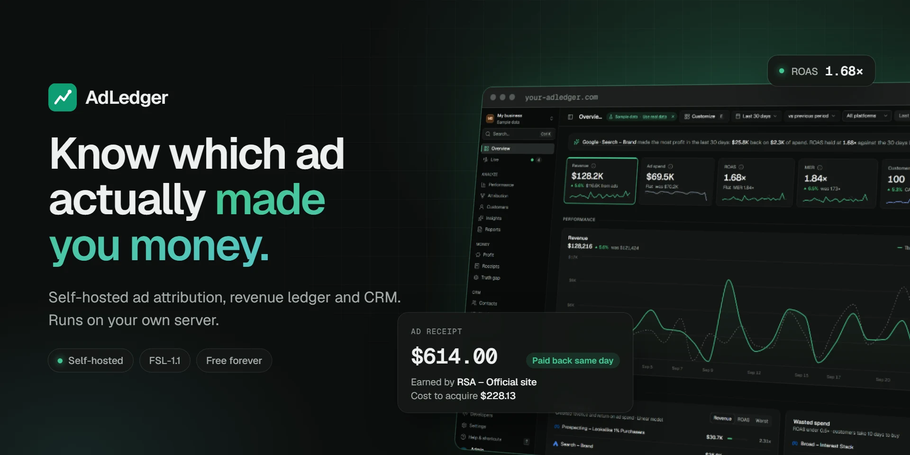
  </picture>
</a>

### Every sale gets a receipt.

**See which ad actually made you money, what that customer really cost, and prove it.**<br />
Self-hosted ad attribution, revenue ledger and CRM.<br />
Free to self-host. Source available ([FSL-1.1](LICENSE)). Your server, your data.

[](LICENSE)
[](https://github.com/ShubhamVankalas/adledger/actions/workflows/ci.yml)
[](https://github.com/ShubhamVankalas/adledger/pkgs/container/adledger)
[](https://github.com/ShubhamVankalas/adledger/stargazers)
[](docs/SELF_HOSTING.md)
[](CONTRIBUTING.md)

**[Website](https://shubhamvankalas.github.io/adledger/)** · **[Install](#install-in-60-seconds)** · **[Docs](#documentation)** · **[Features](#what-you-get)** · **[Developers](#developers-api-webhooks-recipes)** · **[Roadmap](docs/ROADMAP.md)**

<a href="https://shubhamvankalas.github.io/adledger/"></a>

</div>

---

## What is AdLedger?

AdLedger joins **ad spend** (Meta, Google and 7 more networks), **website events** from a 2.4 KB pixel,
**leads** and **real payments** (Stripe and 12 more) into one ledger, so every number is computed in SQL,
split to the cent and shown per campaign, ad set and ad. One container plus PostgreSQL, on a server you control.

Not sure yet? **[Take the 3D product tour](https://shubhamvankalas.github.io/adledger/)**, or run the demo below with 90 days of sample data.

## What you get

<table>
<tr>
<td width="50%"><a href="docs/FEATURES.md#receipts">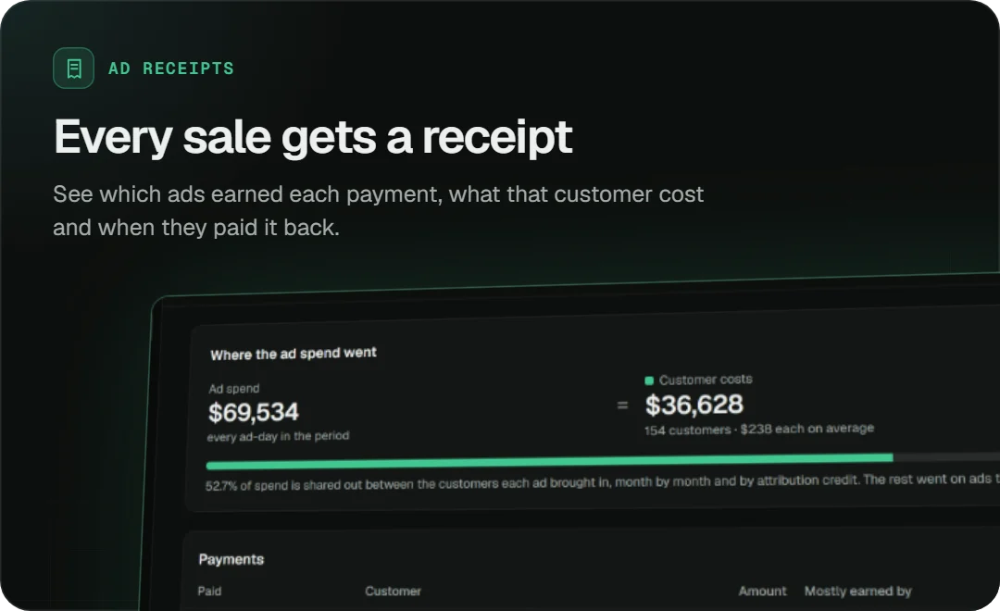</a></td>
<td width="50%"><a href="docs/FEATURES.md#live">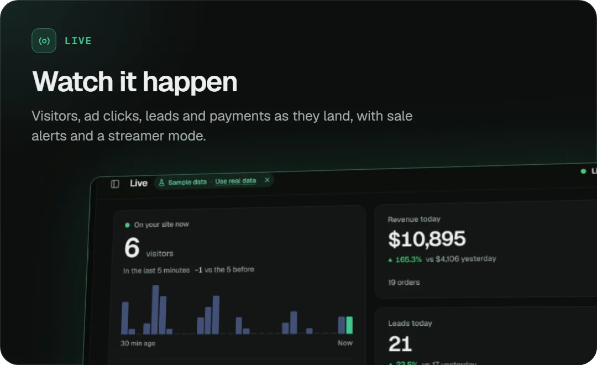</a></td>
</tr>
<tr>
<td><a href="docs/FEATURES.md#attribution">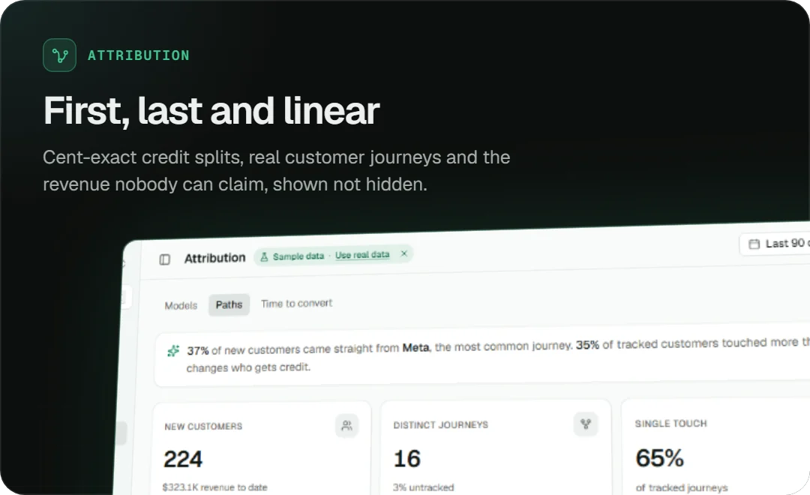</a></td>
<td><a href="docs/FEATURES.md#profit">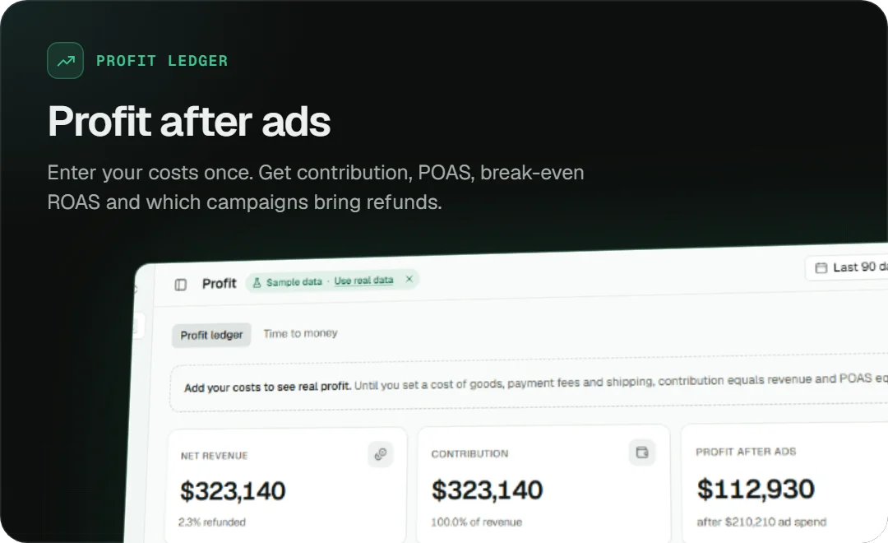</a></td>
</tr>
<tr>
<td><a href="docs/FEATURES.md#pipeline">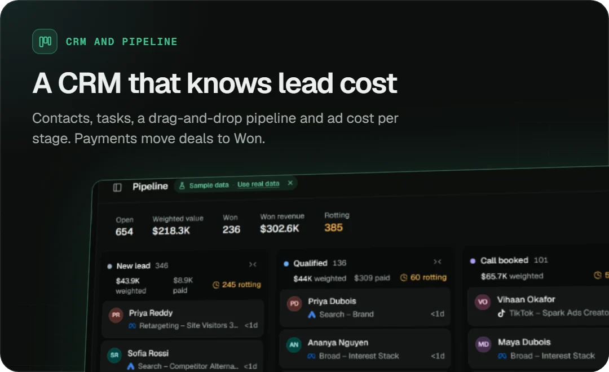</a></td>
<td><a href="docs/REPORTS.md">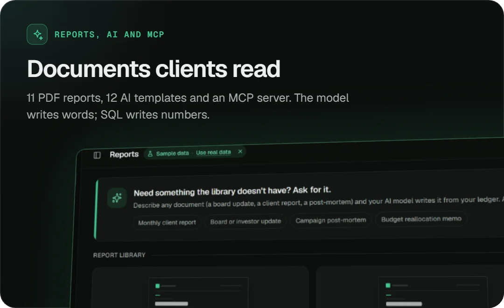</a></td>
</tr>
<tr>
<td><a href="docs/WEBHOOKS.md">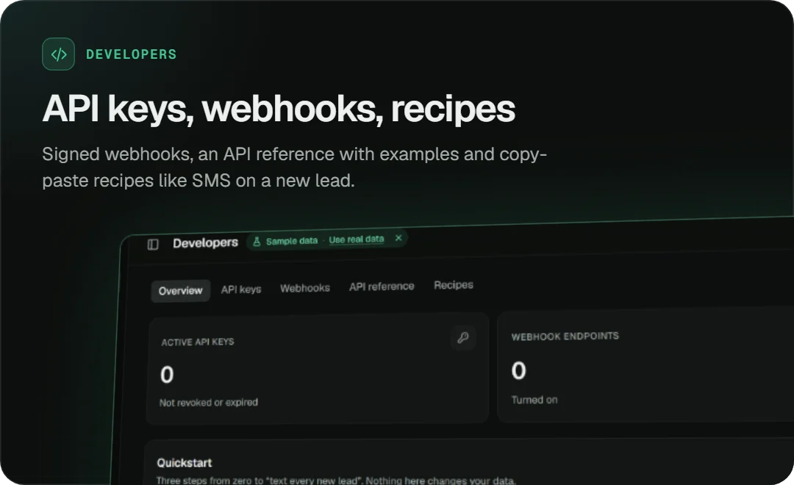</a></td>
<td><a href="docs/COMPLIANCE.md">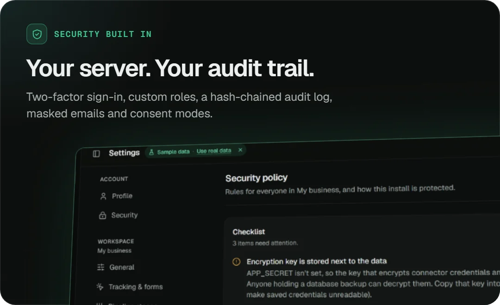</a></td>
</tr>
</table>

<p align="center">
  <b>Free to self-host, with the source on GitHub.</b> No per-seat or revenue-share pricing. Unlimited users, workspaces and client logins.<br />
  <b>Your data never leaves your server.</b> No telemetry, no licence check, no phone-home.
</p>

## Install in 60 seconds

You need [Docker](https://docs.docker.com/get-docker/). This starts AdLedger with 90 days of demo data:

```bash
git clone https://github.com/ShubhamVankalas/adledger.git && cd adledger
ADMIN_EMAIL=admin@example.com ADMIN_PASSWORD=adledger-demo-123 DEMO_DATA=true docker compose up -d
```

Open **http://localhost:3000** and sign in. The demo runs on mock connectors that speak each platform's
real API format (Meta, Google, TikTok, LinkedIn, Microsoft, Stripe). Or run plain `docker compose up -d`,
create your account and choose **Explore with demo data**.

<details>
<summary><b>Docker Desktop (Windows or macOS)</b></summary>

<br />

1. Install [Docker Desktop](https://docs.docker.com/desktop/) and start it.
2. Clone the repo, then in PowerShell run:

```powershell
$env:ADMIN_EMAIL="admin@example.com"; $env:ADMIN_PASSWORD="adledger-demo-123"; $env:DEMO_DATA="true"
docker compose up -d
```

3. Open http://localhost:3000. Leave out the three variables to start empty and create your own account.

</details>

<details>
<summary><b>A server with your own domain</b> (automatic HTTPS, random secrets generated)</summary>

<br />

Point an A record at the server, open ports 80 and 443, then:

```bash
curl -fsSL https://raw.githubusercontent.com/ShubhamVankalas/adledger/main/install.sh | DOMAIN=ads.yourcompany.com sh
```

The script installs nothing but AdLedger: it downloads `docker-compose.yml`, writes a `.env` with
generated secrets, and starts the app, PostgreSQL 16 and Caddy. Re-run it to upgrade.

</details>

<details>
<summary><b>Render, Railway, Coolify and friends</b></summary>

<br />

| Where | How |
|---|---|
| **Render** | [](https://render.com/deploy?repo=https://github.com/ShubhamVankalas/adledger) uses [`render.yaml`](render.yaml): web service, managed PostgreSQL 16 and a generated `APP_SECRET`. |
| **Railway** | Deploy from your fork (uses the `Dockerfile` and [`railway.json`](railway.json)), add PostgreSQL, set `DATABASE_URL=${{Postgres.DATABASE_URL}}`. |
| **Coolify, Dokploy, CapRover, Portainer** | Deploy [`docker-compose.yml`](docker-compose.yml) as-is. |
| **Single container, no PostgreSQL** | `docker run -d -p 3000:3000 -v adledger:/data ghcr.io/shubhamvankalas/adledger` (embedded database; fine for trials, use PostgreSQL for production). |

</details>

<details>
<summary><b>From source, no Docker</b> (Node 20+ and pnpm)</summary>

<br />

```bash
pnpm install && pnpm dev     # http://localhost:3000, embedded database in ./.data
```

</details>

Upgrade with `docker compose pull && docker compose up -d`. Backups, HTTPS and every setting:
[docs/SELF_HOSTING.md](docs/SELF_HOSTING.md).

## Features

### A dashboard you arrange yourself

<table>
<tr>
<td width="46%"></td>
<td valign="top">

The **Overview** is a widget board. Press **Customize** (or `E`) to drag, resize and group widgets and
pin up to six KPI tiles. Start from a preset (Minimal, E-commerce, Lead gen, Agency) or set the
workspace default for the whole team.

- A **briefing line** names what mattered, built from SQL numbers, not a language model.
- **KPI tiles** with change vs the previous period, sparklines and a metric explorer.
- Date presets, compare, platform filter and attribution model live in the URL, so every view is a link.

</td>
</tr>
</table>

### Live

<table>
<tr>
<td valign="top">

Visitors on your site right now, today vs the same time yesterday, and a real-time feed of ad clicks,
visits, leads, payments and refunds (server-sent events, no extra service).

- The **Live pill** in every page header shows visitors and today's revenue, one click from Live.
- **Streamer mode** (`S`) hides names. **Sale alerts** (`A`) pop a toast for every payment.

</td>
<td width="46%"></td>
</tr>
</table>

### Performance and attribution

<table>
<tr>
<td width="46%"></td>
<td valign="top">

Campaigns, ad sets and ads with **column presets**, NC-ROAS, a **platform gap** column (what the platform
reports next to what AdLedger verified), a **quadrant** that sorts campaigns into scale, test, fix and
kill, and saved views with a **peek** into the people a campaign brought in.

</td>
</tr>
<tr>
<td valign="top">

**First touch, last touch and linear**, switchable anywhere, with exact integer-cent splits that always
add up to the payment. **Paths** shows the journeys customers took, **Time to convert** shows whether
your attribution window is long enough, and unattributed revenue is always shown, never hidden.

</td>
<td width="46%"></td>
</tr>
<tr>
<td width="46%"></td>
<td valign="top">

**Customers: LTV and cohorts.** Lifetime value by acquiring channel, LTV:CAC and a cohort heatmap by
first-payment month (retention, cumulative LTV or revenue), with a dot where each cohort paid back its
CAC. Renewals are credited to the journey that first acquired the customer.

</td>
</tr>
</table>

### Signature money features

<table>
<tr>
<td width="50%" valign="top">

**Ad Receipts.** Every payment shows which ads earned it, what that customer cost in ad spend and when
they paid it back. Customer costs plus unallocated equal total spend, to the cent.


</td>
<td width="50%" valign="top">

**Profit Ledger.** Enter cost of goods, payment fees and shipping once. Get contribution, profit after
ads, **POAS**, break-even ROAS and a P&amp;L waterfall, plus which ads bring buyers who refund.


</td>
</tr>
<tr>
<td valign="top">

**Truth Gap.** "Meta says its ads made you this much; real payments from people who clicked them were
that much." Claimed vs verified conversions and value per platform and campaign.

</td>
<td valign="top">

**Too-early guardrails.** Median and p80 days from first click to first payment, a "too early to judge"
tag on young campaigns, and **pause drafts** you download as a Meta or Google Ads Editor file. AdLedger
never writes to your ad accounts.

</td>
</tr>
</table>

### A CRM that knows what each lead cost

<table>
<tr>
<td width="33%" valign="top"><br /><b>Contacts.</b> Saved views, filters, groups, bulk actions with undo, fast at 10k+ contacts.</td>
<td width="33%" valign="top"><br /><b>Record page.</b> Ad clicks, visits, forms and payments on one timeline, plus notes, tasks and attribution.</td>
<td width="33%" valign="top"><br /><b>Pipeline.</b> Drag by mouse, touch or keyboard. Payments move contacts to Won automatically.</td>
</tr>
</table>

Also: **My tasks**, **CSV import** with a preview before anything is written, and **duplicate review and merge** with re-attribution.

### Reports, PDFs and AI documents

<table>
<tr>
<td width="46%"></td>
<td valign="top">

**Eleven print-ready PDF reports**: executive summary, weekly performance, attribution model comparison,
LTV and cohorts, wasted spend, **channel mix**, **lead source quality**, **creative and ad leaderboard**,
**funnel and time to convert**, **pipeline and CRM activity** and **profit and refunds**.

Your logo on the masthead, a methodology appendix, a "Prepared for" watermark and a fingerprint on every
page that anyone can check at `/verify`. Download, call the API, or **schedule** weekly or monthly emails.
Rendered in-process: no headless browser, no extra container. [docs/REPORTS.md](docs/REPORTS.md)

</td>
</tr>
</table>

**AI document generator.** Pick one of **12 prompt templates** (monthly client report, board update,
post-mortem, budget memo, Meta vs Google, lead quality audit, stand-up, case study, creative brief,
quarter review, funnel leaks, refunds) or write your own. Your model writes the words; AdLedger draws
every KPI, table and chart from SQL, removes any sentence with a number that is not in the data, and lays
it out as a branded, fingerprinted PDF with an in-app preview.

### Insights and Ask AI

<table>
<tr>
<td valign="top">

**Action cards** (move budget, room to grow, revenue drop, CAC up) where every figure links to its source
row, a weekly report marked **All numbers verified**, and **Ask**: plain-language questions answered from
read-only SQL tools, with the table each answer came from. Any number a model invents is flagged. Works
with no model at all, a local model (Ollama, LM Studio) or OpenAI, Anthropic, Gemini, OpenRouter,
DeepSeek and any OpenAI-compatible endpoint.

</td>
<td width="46%"></td>
</tr>
</table>

### Alerts, sharing, goals and speed

- **Alert rules** on CAC, CPL, ROAS, spend, revenue or leads with cooldowns, plus optional **anomaly detection**.
- **Notifications** by email, Slack, Discord, Microsoft Teams, SMS (Twilio) or signed webhook.
- **Share links**: read-only aggregate dashboards with locked filters, an expiry, a view count and one-click revoke. Contact details are never shared.
- **Targets and goals** with pacing and projection to period end.
- **Ctrl K / ⌘K** finds any page, contact or campaign; `G` then a letter jumps between pages; `?` lists shortcuts.
- **Product tour**: a 2-minute spotlight tour on first sign-in that shows each person only what their role can open.
- **Your colours**: **20 solid themes and 10 gradients** for the whole organization, all passing WCAG AA. Profit and loss stay green and red.
- **Custom roles** with per-page and per-action permissions, next to five built-in roles (owner, admin, analyst, viewer, client).
- Installable on your phone (PWA) with a bottom tab bar, and a dark mode that follows your system.

### Developers: API, webhooks, recipes

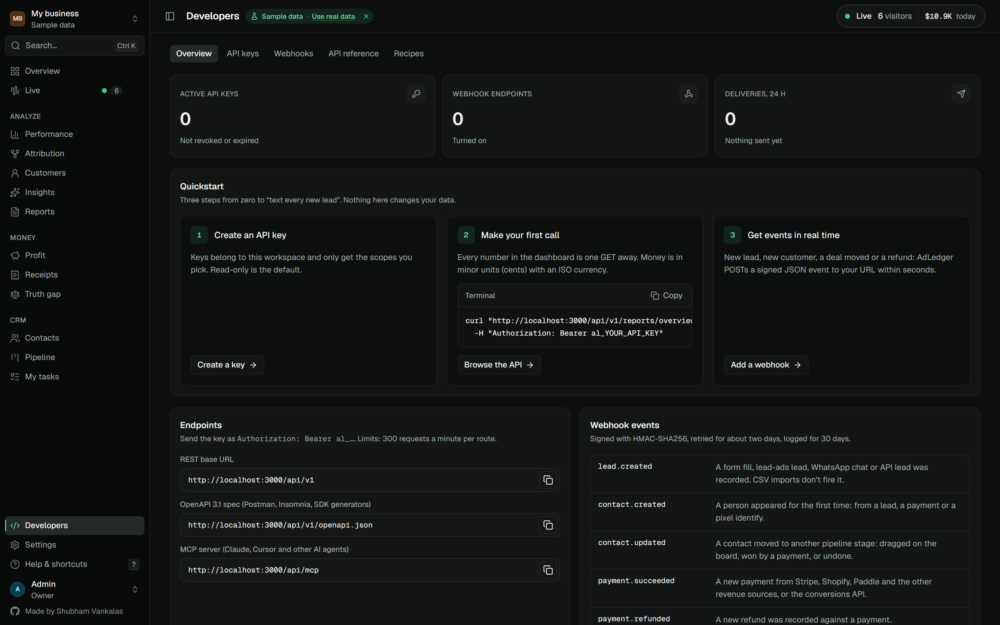

A dedicated **Developers** area (owners and admins by default) for wiring AdLedger into your own tools:

- **API keys** with scopes (`reports:read`, `mcp`, `contacts:read`, `contacts:pii`, `ingest:write`), optional expiry, stored hashed.
- **Signed outbound webhooks** for `lead.created`, `contact.created`, `contact.updated`, `payment.succeeded`
  and `payment.refunded`: HMAC-SHA256 signatures, retries with backoff for about two days, a 30-day delivery
  log with redeliver, **Send test event**, masked emails unless you opt in, private URLs blocked.
  [docs/WEBHOOKS.md](docs/WEBHOOKS.md)
- **API reference** generated from the OpenAPI 3.1 spec, with curl, JavaScript and Python examples. [docs/API.md](docs/API.md)
- **Recipes** you can copy: **SMS a new lead in seconds** (Twilio), send a Cal.com booking link, shout out
  payments in Slack, connect Zapier, Make or n8n, or append rows to Google Sheets.

```bash
# Pull leads with a read key
curl -H "Authorization: Bearer al_..." https://your-adledger/api/v1/leads
```

### MCP server for AI assistants

Ask Claude, Cursor or any MCP client *"which ads made money last month?"* against your own ledger.
Create a key in **Developers → API keys**, then:

```bash
claude mcp add --transport http adledger https://your-adledger/api/mcp --header "Authorization: Bearer al_..."
```

<details>
<summary>14 read-only tools</summary>

<br />

`get_overview`, `get_performance`, `find_wasted_spend`, `compare_periods`, `get_platform_breakdown`,
`get_timeseries`, `search_campaigns`, `contact_stage_funnel`, `list_contacts`, `get_contact_journey`,
`get_ad_receipt`, `get_latest_insights`, `get_sync_status`, `list_integrations`.

Every tool is annotated read-only and a test proves none of them changes data. Emails are masked.
Setup for Claude Desktop and Cursor: [docs/MCP.md](docs/MCP.md).

</details>

### Integrations

Connected from **Settings → Integrations**, with step-by-step instructions on each card and a mock mode for every connector.

| | |
|---|---|
| **Ad platforms** | Meta Ads, Google Ads, Microsoft Ads, TikTok Ads, LinkedIn Ads, Pinterest Ads, Snapchat Ads, Reddit Ads, X Ads. Anything else by CSV or the Spend API. |
| **Payments and stores** | Stripe (paste one key, the webhook is created for you), Shopify, WooCommerce, Paddle, Lemon Squeezy, Razorpay, PayPal, Chargebee, Recurly, Gumroad, Cashfree, Instamojo, PhonePe. Anything else by CSV or the Conversions API. |
| **CRMs** | Won deals from HubSpot and Pipedrive. |
| **Lead forms** | Any form with `data-adledger-lead`, Typeform, Tally, Webflow, Zapier or Make webhooks, native Meta Lead Ads, Google Ads lead forms, TikTok Lead Generation and WhatsApp click-to-chat. |
| **Your website** | One `<script>` tag (2.4 KB gzipped), a [WordPress/WooCommerce plugin](integrations/wordpress), a [Shopify custom pixel](integrations/shopify), a [GTM template](integrations/gtm) and [guides](docs/integrations/) for Webflow, Wix, Squarespace, Framer and Next.js. |
| **Back to the ad platforms** (beta) | Consent-aware conversion upload to the Meta Conversions API and Google Ads, hashed identifiers only. |
| **Notifications** | Email, Slack, Discord, Microsoft Teams, SMS (Twilio), signed webhook. |

Connectors other than Meta, Google Ads and Stripe are in beta: tested against real-format fixtures, not
yet verified on live accounts. Details: [docs/CONNECTORS.md](docs/CONNECTORS.md).

## Screenshots

| Overview | Revenue and ROAS by attribution model |
|---|---|
|  | 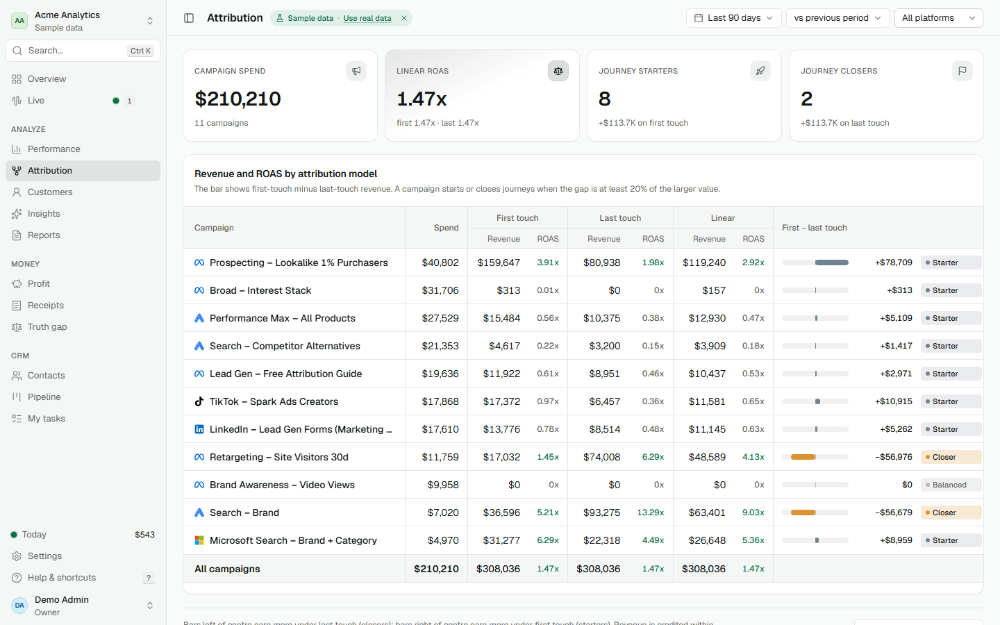 |
| **Time to convert** | **Time to money and pause drafts** |
| 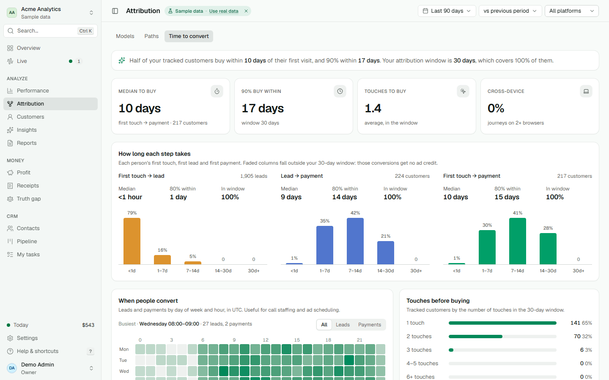 | 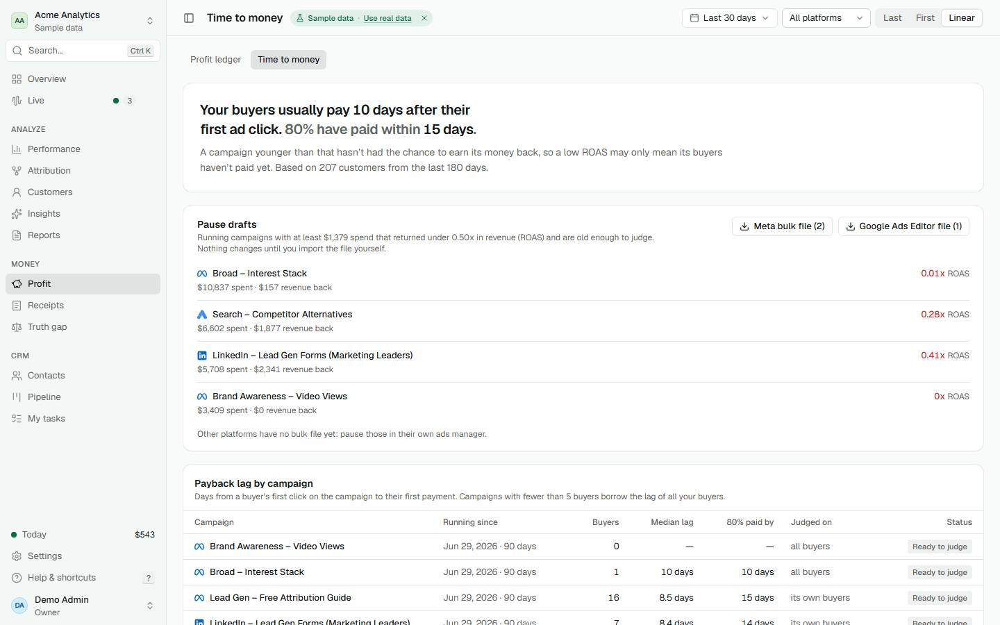 |
| **Ask your numbers** | **Security policy and posture checklist** |
| 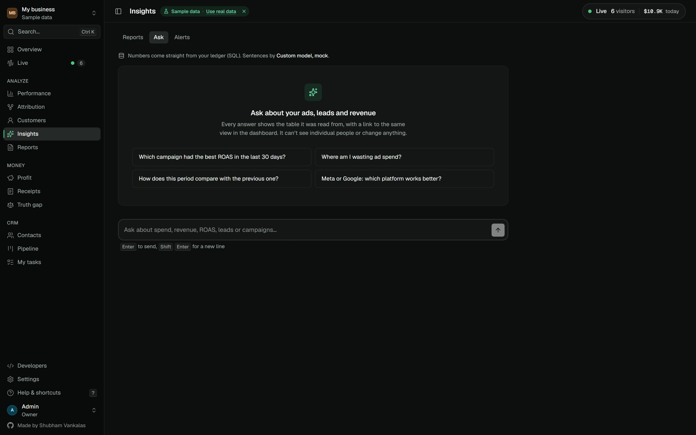 | 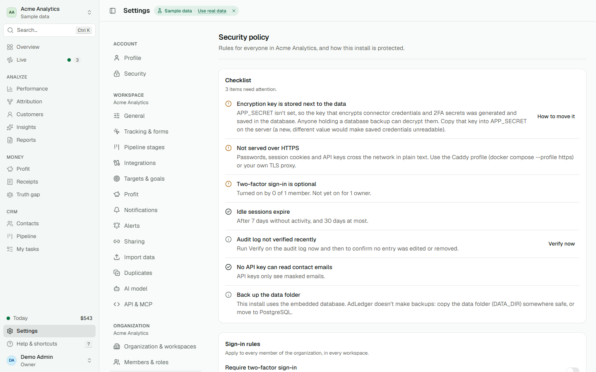 |
| **30+ integrations** | **Guided setup checklist** |
|  |  |

<details>
<summary>More: tracking, team, alerts, audit log, two-factor sign-in, notifications, report verification</summary>

<br />

| Tracking snippet and consent modes | Members and roles |
|---|---|
|  |  |
| **Alert rules and anomaly detection** | **Hash-chained audit log** |
| 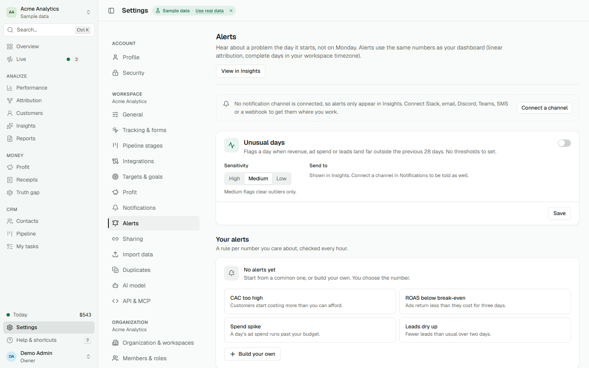 | 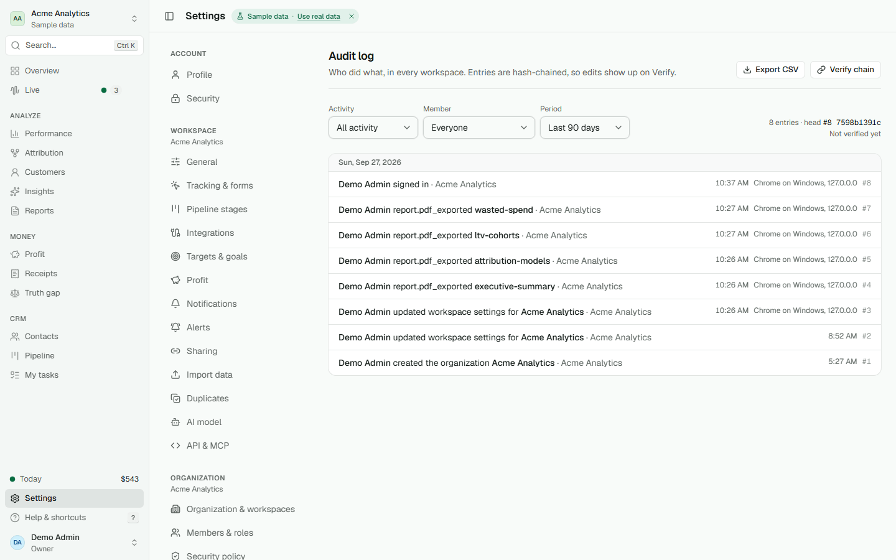 |
| **Two-factor sign-in and devices** | **Notification channels** |
| 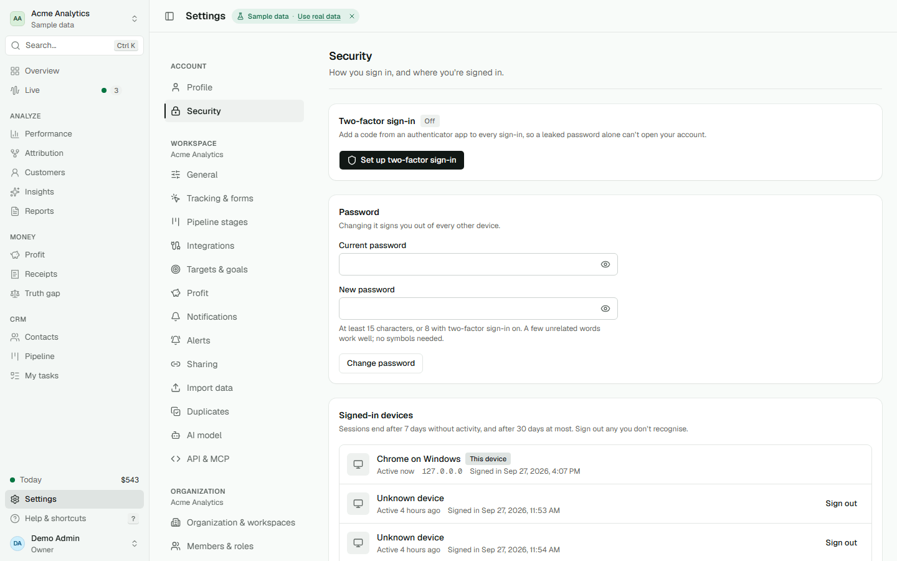 |  |
| **Verify a PDF report** | |
| 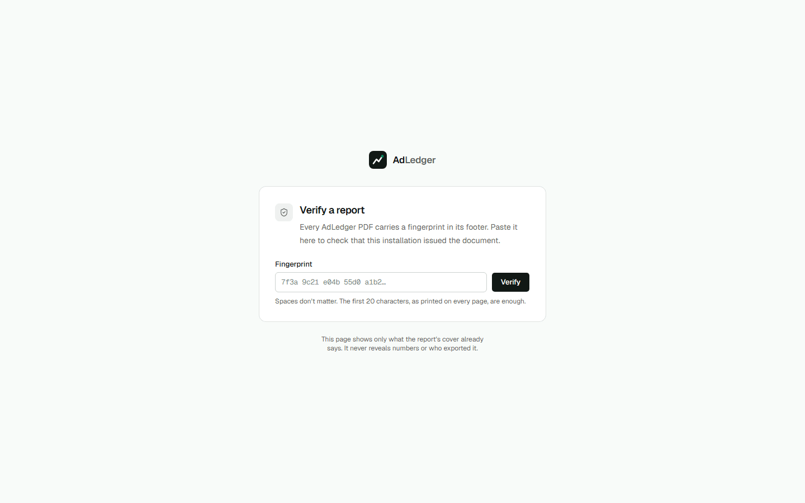 | |

</details>

**On your phone**: installable as an app, with a floating tab bar and a one-tap filter sheet.

<p>
  
  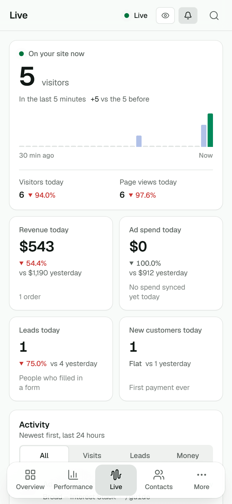
  
  
</p>

## Security and compliance

<p>
  
  
  
  
  
  
  
</p>

AdLedger is self-hosted software, so **it holds no certification and makes no compliance claim on your
behalf**. It ships **GDPR-ready tooling and SOC 2-aligned controls** to help you meet GDPR, UK GDPR,
CCPA/CPRA and India's DPDP; when you self-host, you are the data controller. SOC 2 and ISO 27001 assess
the organisation that runs a service, so they apply to you, not to the project. What AdLedger gives that
organisation is controls and evidence that make those audits easier.

| Framework | What AdLedger provides | Guide |
|---|---|---|
| **GDPR / UK GDPR** | Consent modes, export, erasure, retention, hashing, masking, audit trail | [Art. by Art.](docs/COMPLIANCE.md#2-gdpr-and-uk-gdpr) |
| **CCPA / CPRA** | Global Privacy Control, consent-aware uploads, access and delete | [Requirements](docs/COMPLIANCE.md#3-ccpa--cpra) |
| **ePrivacy / PECR** | Consent-required and cookieless pixel modes, banner snippets | [Cookies](docs/COMPLIANCE.md#4-eprivacy-and-pecr-cookies) |
| **SOC 2** | Controls that map to CC6 (access), CC7 (monitoring), CC8 (change), C1 and P criteria | [Mapping](docs/COMPLIANCE.md#5-soc-2-trust-services-criteria) |
| **ISO/IEC 27001:2022** | Supports the relevant Annex A controls | [Mapping](docs/COMPLIANCE.md#6-isoiec-270012022-annex-a) |
| **OWASP Top 10, ASVS, CIS Docker** | Self-assessed against the public lists; no formal verification | [Tables](docs/COMPLIANCE.md#7-owasp-top-10-2021-and-asvs-level-2) |

Not covered: HIPAA and health data, and children's data. Card data never touches AdLedger (your payment
provider holds it). See [what is not covered](docs/COMPLIANCE.md#9-what-is-not-covered) and the
[go-live checklist](docs/COMPLIANCE.md#10-operator-checklist-for-going-live).

<details>
<summary><b>Every control, by area</b></summary>

<br />

| Area | Controls |
|---|---|
| **Sign-in** | Free two-factor sign-in (TOTP + recovery codes) that owners can require org-wide, with a documented break-glass for a locked-out owner. scrypt passwords under a NIST SP 800-63B-4 policy. |
| **Sessions** | Hashed tokens, idle timeout and maximum lifetime, a device list with sign out one or everywhere, new-device emails. |
| **Access** | Five built-in roles plus **custom roles** with per-page and per-action permissions. Contact emails **masked by role**, with every reveal audited. Separate permissions for aggregate CSVs, contact exports and PDFs. |
| **PII** | Raw emails only in the contacts table; SHA-256 hashes everywhere else. IPs truncated. Stored payloads redacted. |
| **Secrets and keys** | Connector credentials and 2FA secrets encrypted with AES-256-GCM. API keys stored hashed, with **scopes** and optional expiry. |
| **Audit** | Tamper-evident, **hash-chained audit log** with Verify, filters and CSV export. **Security alerts** for new keys, webhooks, role changes, 2FA resets, bulk exports and new-device sign-ins. |
| **Consent** | Pixel consent modes (opt-out, consent required, cookieless) and **Global Privacy Control**. Conversion uploads carry consent signals, and people who said no are never uploaded. |
| **Data rights** | Per-contact export and erasure (UI and API), full workspace export, raw-event retention. |
| **Leak deterrence** | Watermarked, fingerprinted PDFs verifiable at `/verify`, an export log, aggregate-only share links. |
| **Web and supply chain** | CSP and security headers, SSRF guards, signed webhooks. CodeQL, dependency review, `pnpm audit`, Trivy image scans, Dependabot, SBOM and provenance on release images. |
| **Disclosure** | `/.well-known/security.txt` on every install and private vulnerability reporting ([SECURITY.md](SECURITY.md)). |

</details>

Read the [Trust and security page](docs/SECURITY.md) for the mechanisms and the hardening checklist, and
the [Compliance guide](docs/COMPLIANCE.md) for the framework mappings and the statements that are safe to
make about your install.

## Architecture

One Next.js app and PostgreSQL. The dashboard, REST API, pixel collector, webhooks, MCP server, live
stream, PDF rendering and background jobs all run in a single container.

```
 your website ──al.js──▶ /api/v1/collect ─────┐
 forms, CRMs ──webhook─▶ /api/v1/webhooks ────┤
 Stripe, stores ─webhook▶ /api/v1/webhooks ───┼──▶  AdLedger (Next.js)  ──▶  PostgreSQL 16
 ad platforms ◀── scheduled sync / uploads ───┤        ▲ dashboard, /share, /verify
 Claude, Cursor ──MCP──▶ /api/mcp ────────────┘        └──▶ signed webhooks out
```

**Stack:** Next.js 16 · React 19 · TypeScript · PostgreSQL 16 (Drizzle ORM, embedded PGlite for trials) ·
Tailwind CSS v4 + shadcn/ui · Recharts · react-pdf · Vercel AI SDK · MCP SDK · vitest · Playwright.
Details and design decisions: [docs/ARCHITECTURE.md](docs/ARCHITECTURE.md).

## Documentation

| Doc | What's in it |
|---|---|
| [Features](docs/FEATURES.md) | Every page and setting, grouped |
| [Self-hosting](docs/SELF_HOSTING.md) | Install options, HTTPS, upgrades, backups, configuration |
| [Connectors](docs/CONNECTORS.md) | Setting up each integration, UTM templates, mock mode |
| [Site-builder guides](docs/integrations/README.md) | Webflow, Wix, Squarespace, Framer, Next.js, GTM, Shopify, WordPress |
| [Pixel](docs/PIXEL.md) | The tracking script, its API and consent |
| [Reports](docs/REPORTS.md) | PDF reports, AI documents, schedules, watermarks and verification |
| [API](docs/API.md) · [Webhooks](docs/WEBHOOKS.md) · [MCP](docs/MCP.md) | REST API, signed outbound webhooks and recipes, AI assistant tools |
| [Trust and security](docs/SECURITY.md) | Controls, privacy, hardening checklist, disclosure |
| [Compliance](docs/COMPLIANCE.md) | GDPR, CCPA, SOC 2, ISO 27001, OWASP and CIS mappings, go-live checklist, safe claims |
| [FAQ](docs/FAQ.md) | Data, accuracy, iOS, cost, 2FA lockout, compliance questions |
| [Architecture](docs/ARCHITECTURE.md) · [Product](docs/PRODUCT.md) · [Roadmap](docs/ROADMAP.md) | How it's built, who it's for, what's next |

## Roadmap

What is shipped and what is next lives in [docs/ROADMAP.md](docs/ROADMAP.md). Ideas and votes are
welcome in [issues](https://github.com/ShubhamVankalas/adledger/issues).

## Contributing

```bash
pnpm install
pnpm dev                   # http://localhost:3000, embedded database, no Docker needed
pnpm test                  # vitest on an embedded Postgres, every connector mocked
pnpm lint && pnpm typecheck
pnpm build && pnpm e2e     # Playwright browser tests with axe accessibility checks
```

Bug reports, connectors, report kinds and docs fixes are welcome. Start with
[CONTRIBUTING.md](CONTRIBUTING.md) and the [roadmap](docs/ROADMAP.md). Found a security issue? See
[SECURITY.md](SECURITY.md).

## License

AdLedger is source available under the [Functional Source License, FSL-1.1-ALv2](LICENSE), a "Fair Source"
licence. It is not an OSI-approved open source licence.

- **What you can do:** use it and self-host it for free, including for a business or an agency running its
  own ads, read and modify the code, and contribute changes back.
- **What you can't do:** sell it, sell a modified version, or offer it (or something substantially similar
  built from it) as a competing product or hosted service.
- **After two years:** each version automatically converts to the permissive Apache-2.0 licence, counted
  from the date that version was released.

Contributions are accepted under the same licence (see [CONTRIBUTING.md](CONTRIBUTING.md)). The name and logo
are covered by [TRADEMARKS.md](TRADEMARKS.md). The WordPress plugin in `integrations/wordpress` is a separate
work licensed GPL-2.0-or-later, as WordPress.org requires.

<div align="center">

---

<a href="https://github.com/ShubhamVankalas"></a>

**Built by [Shubham Vankalas](https://github.com/ShubhamVankalas)**, as a free-to-self-host tool for founders who want to know which ad paid off.

**If AdLedger shows you which ad made you money, [give it a star](https://github.com/ShubhamVankalas/adledger).** It helps other founders find it.

<a href="https://star-history.com/#ShubhamVankalas/adledger&Date">
  <picture>
    <source media="(prefers-color-scheme: dark)" srcset="https://api.star-history.com/svg?repos=ShubhamVankalas/adledger&type=Date&theme=dark" />
    
  </picture>
</a>

[Website](https://shubhamvankalas.github.io/adledger/) · [Issues](https://github.com/ShubhamVankalas/adledger/issues) · [Contribute](CONTRIBUTING.md)

</div>
