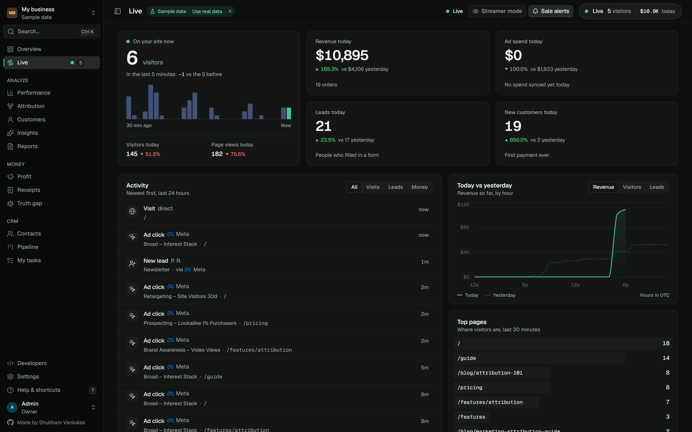
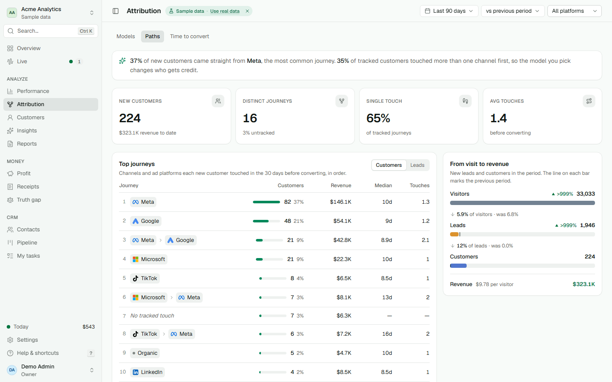
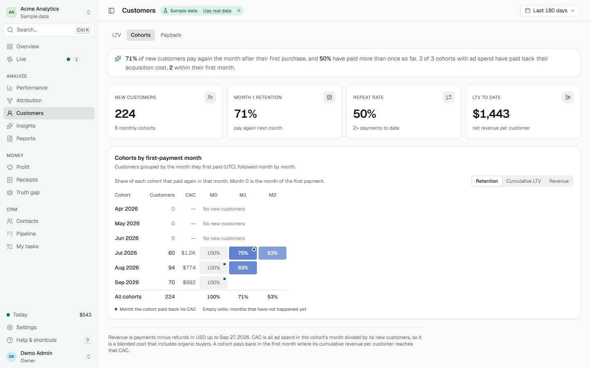
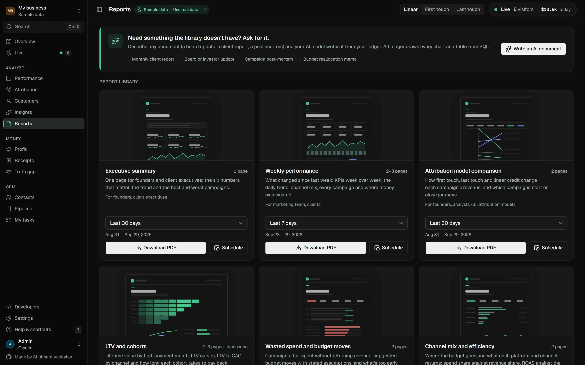
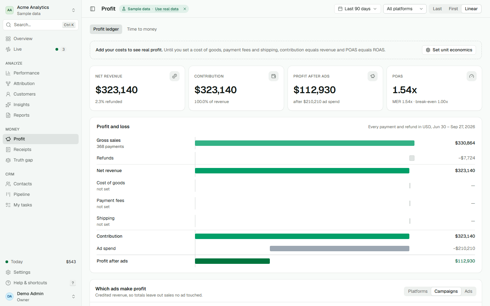
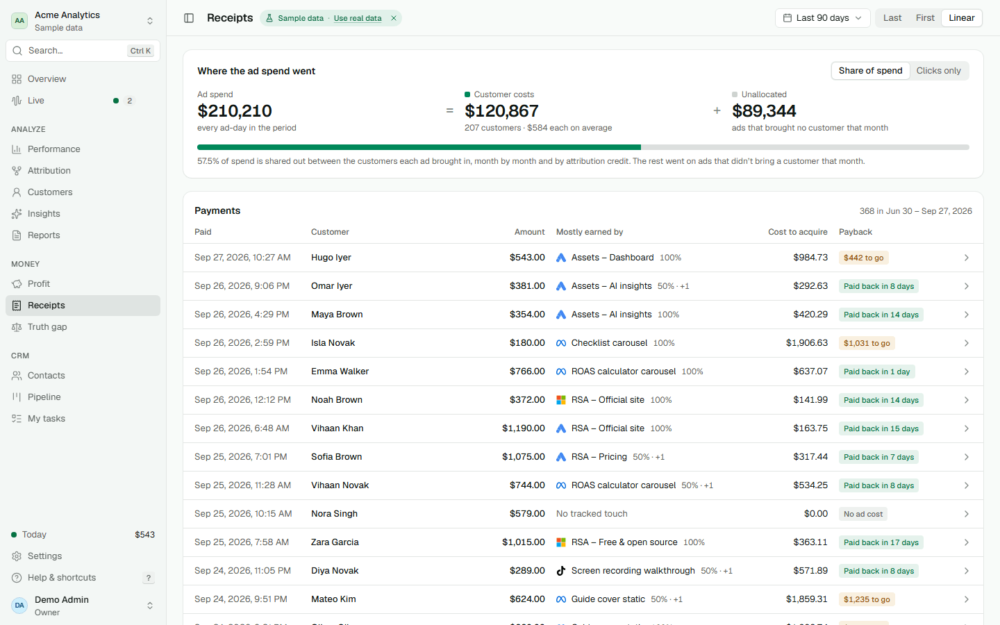
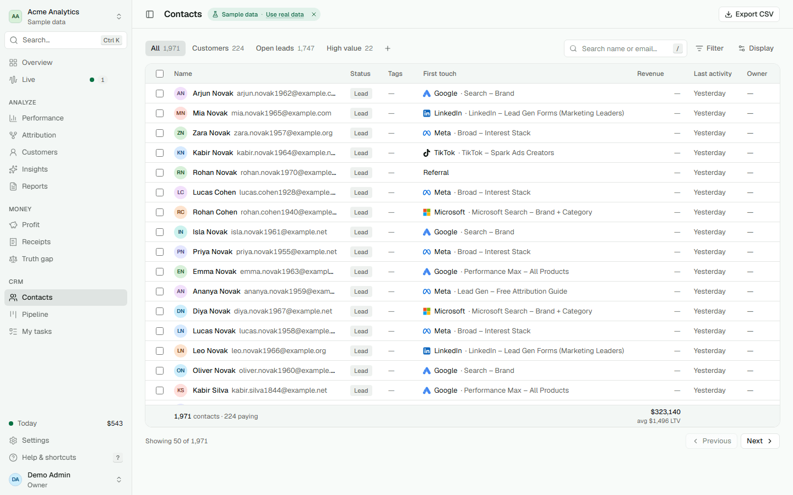
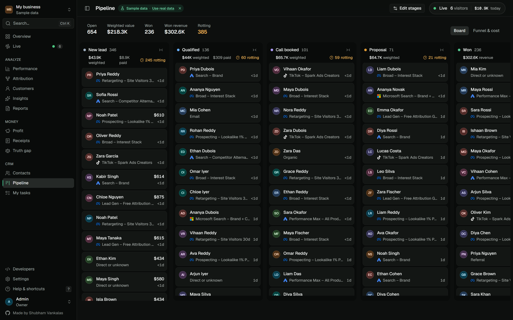

# Features

Every page and setting in AdLedger, grouped the way the sidebar groups them. Each section links to
the deeper doc where one exists. For what's planned next, see [ROADMAP.md](ROADMAP.md).

- [Everywhere in the app](#everywhere-in-the-app)
- [Overview](#overview) · [Live](#live)
- Analyze: [Performance](#performance) · [Attribution](#attribution) · [Customers](#customers) · [Insights](#insights) · [Reports](#reports)
- Money: [Profit](#profit) · [Receipts](#receipts) · [Truth gap](#truth-gap)
- CRM: [Contacts](#contacts) · [Contact record](#contact-record) · [Pipeline](#pipeline) · [My tasks](#my-tasks)
- [Public pages](#public-pages): share links, report verification
- [Settings](#settings): account, workspace, organization
- [Tracking and data in](#tracking-and-data-in) · [Data out](#data-out-api-mcp-and-exports) · [Security and privacy](#security-and-privacy) · [Self-hosting](#self-hosting)

All numbers on every page come from SQL over your ledger (`src/lib/reports*.ts`). Money is stored as
integer minor units, and split credit always adds up to the payment. The AI model never computes a
number.

## Everywhere in the app

| Feature | What it does |
|---|---|
| **Filter bar** | Date presets (today to year to date, plus custom ranges on a two-month calendar), compare with the previous period, the previous year or nothing, platform filter and attribution model (last, first, linear). Everything is kept in the URL, so any view can be bookmarked or shared with a teammate. Below 1280 px the bar folds into one button that opens a sheet. |
| **Command palette** | `Ctrl K` / `⌘K` (or the search button) finds pages, settings sections, contacts, campaigns, ad sets and ads. Recent items come first. Type `>` for actions only (sync now, copy the pixel snippet, switch model or range, customize the Overview, invite a teammate). Type `?` to send the question to Ask AI. Search goes through `POST /api/v1/search`, is limited to the current workspace and respects email masking. |
| **Keyboard shortcuts** | `G` then a letter jumps to a page (`O` Overview, `V` Live, `P` Performance, `A` Attribution, `R` Customers, `I` Insights, `C` Contacts, `D` Pipeline, `T` My tasks, `S` Settings). `/` focuses the page's search box, `[` or `Ctrl B` collapses the sidebar, `?` lists every shortcut registered on the current page. Pages add their own: `E` customize the Overview, `J`/`K` move through rows, `X` toggle compare, `Shift Q` table or quadrant, `S` streamer mode, `A` sale alerts, `N`/`T` new note or task. |
| **Sidebar** | Workspace switcher, groups for Analyze, Money and CRM, a live visitor count, a setup-progress ring until setup is done, and an icon-only rail mode remembered per browser. |
| **Sample data pill** | Demo workspaces show a dismissible "Sample data" pill with a link to start with real data. |
| **Phone and tablet** | Installable as an app (PWA). A floating tab bar (Overview, Performance, Live, Contacts, More) that hides while you scroll, tables that fold into cards, and a bottom sheet for filters. |
| **Dark mode** | Follows your system setting. |
| **Printing** | `Ctrl P` / `⌘P` on any page prints without the sidebar, filters or buttons, in light colours, with charts scaled to the paper. See [REPORTS.md](REPORTS.md#printing-any-page). |
| **Loading and errors** | Every page has a same-shape loading placeholder and an error screen with Retry; widgets fail one at a time instead of taking the page down. |

## Overview

`/` · A customizable widget board.

- **Briefing line**: one sentence naming what mattered in the period (for example the campaign that
  made the most profit and how ROAS moved), built from SQL numbers.
- **KPI tiles**: revenue, ad spend, ROAS, MER, leads and CPL, customers and CAC, unattributed share.
  Each shows the change against the comparison period, coloured by whether up is good for that
  metric (spend is neutral, CAC going down is good), the previous value and a sparkline with the
  comparison period dashed. Pin and unpin tiles instantly, with Undo.
- **Metric explorer**: click a tile to chart that metric against the comparison period.
- **Widgets**: spend vs revenue (daily, weekly or monthly), revenue by channel, top campaigns
  (by revenue, ROAS or worst), wasted spend with a "too early" marker for young campaigns, platform
  scorecard, funnel (visitors → leads → customers → revenue), conversions heatmap (weekday × hour),
  live now, goals and pacing, truth gap, profit after ads, recent leads and customers (emails always
  masked), and the latest AI insight.
- **Customize** (`E`, or `?edit=1`): add widgets from a searchable drawer, drag them with mouse or
  keyboard, resize, remove, and add, rename, reorder or delete sections. Phones get a simple up/down
  list. Unsaved changes are protected by a warning.
- **Presets**: Minimal, E-commerce, Lead gen and Agency.
- **Personal view or workspace default**: everyone can keep a personal layout; owners and admins set
  the workspace default. Saves are versioned, so an out-of-date tab can't overwrite a newer layout.

## Live

`/live` · What is happening on your site right now.

- Visitors in the last 5 minutes with a minute-by-minute strip for the last 30 minutes.
- Today so far vs the same time yesterday: revenue, ad spend, leads, new customers, visitors and
  page views, in the workspace timezone.
- A real-time **activity feed** of ad clicks, visits, leads, payments and refunds (server-sent
  events), filterable by All, Visits, Leads or Money. People show as initials or masked emails.
- Today vs yesterday by hour for revenue, visitors or leads; top pages and sources for the last 30
  minutes.
- **Streamer mode** (`S`) hides names; **sale alerts** (`A`) show a toast for every payment.
- In a sample-data workspace, simulated activity keeps the page moving while it is open.
- API: `GET /api/v1/live` (stream, dashboard sessions) and `GET /api/v1/live/pulse`.

## Performance

`/performance` · Campaigns, ad sets and ads.

- **Levels**: Campaigns, Ad sets, Ads, with drill-down from a row.
- **Columns**: spend, impressions, clicks, CTR, CPM, CPC, leads, CPL, CVR, lead → customer rate,
  purchases, customers, CAC, AOV, revenue, ROAS, NC-ROAS, and **platform gap** (what the ad platform
  reports next to what AdLedger verified, with the gap %).
- **Presets**: Default, E-commerce, Lead gen, Creative and Custom. The **Display** menu adds, hides and
  reorders columns (drag or keyboard) and switches density.
- **Compare**: the change under every value, a ROAS bar, sticky header, first column and totals row.
- **Quadrant**: spend against return, splitting campaigns into scale, test, fix and kill.
- **Peek**: open a row in a side sheet with its numbers, daily trend, top ad sets or ads and the people
  it brought in; `J`/`K` step through rows and Back closes it.
- **Saved views**: save the current columns, filters and sort as a personal or shared view, and pin
  up to 8.
- **CSV export** of the table.

## Attribution

`/attribution` · How credit is shared between the ads a customer touched.

- **Models**: first touch, last touch and linear, switchable on every page. Credit is split in
  integer cents with the largest-remainder method, so it always adds up. Revenue with no tracked
  touch is reported as unattributed, never guessed. Renewals and repeat payments are credited to the
  journey that acquired the customer.
- **Models tab**: revenue and ROAS per campaign under every model, and which campaigns start
  journeys and which close them.
- **Paths** (`/attribution/paths`): the most common journeys as channel and platform steps, for
  customers or leads, with revenue, median days and touches, plus a visit → lead → customer →
  revenue funnel against the previous period.
- **Time to convert** (`/attribution/time-to-convert`): lag histograms (first touch → lead, lead →
  payment, first touch → payment) with anything beyond your attribution window faded, a recommended
  window, touches before buying, a weekday × hour conversions heatmap and per-campaign median and
  p80 lag.

## Customers

`/customers` · Lifetime value and retention.

- **LTV**: cumulative revenue per customer by first-payment month, LTV:CAC by acquiring channel.
- **Cohorts** (`/customers/cohorts`): a heatmap by first-payment month with Retention, Cumulative LTV
  and Revenue views, cohort CAC, and a marker in the month each cohort paid back its acquisition
  cost. Months that haven't happened yet stay blank.

## Insights

`/insights` · Three tabs.

- **Reports**: 3–5 **action cards** (move budget, room to grow, revenue drop, CAC up, unattributed
  share). Every figure is a chip linking to the row it came from. Below them, the weekly report on
  what changed, wasted spend and where to move budget, marked **All numbers verified** when every
  number in the text matches the ledger. **Generate report** writes a new one on demand.
- **Ask** (`?tab=ask`, or `?` in the command palette): questions in plain language, answered through
  read-only SQL tools. Each answer shows the table it read, with a link to the same view in the
  dashboard. Numbers the model invents are flagged. Without a model, built-in lookups answer common
  questions. History is kept per user. Clients can't use Ask.
- **Alerts**: alert history and what is being watched.
- **Models**: none (rule-based), Ollama or LM Studio (local and free), OpenAI, Anthropic, Gemini,
  OpenRouter, DeepSeek or any OpenAI-compatible endpoint. The model only sees aggregated figures,
  never contacts.

## Reports

`/reports` · Branded PDF reports. Full details: [REPORTS.md](REPORTS.md).

| Report | Pages |
|---|---|
| Executive summary | 1 |
| Weekly performance | 2–3 |
| Attribution model comparison | 2 |
| LTV and cohorts (landscape) | 2–3 |
| Wasted spend and budget moves | 2 |

- Pick a period and model, **Download PDF**, or **Schedule** weekly or monthly email delivery (with
  "skip quiet periods" and **Send now**).
- Your organization's logo on the masthead, a methodology appendix, and on every page a
  "Prepared for" watermark, page numbers and a **fingerprint** that can be checked at `/verify`.
- Every export is written to an export log and the audit log. Clients can download aggregate PDFs
  only while the organization allows it.
- API: `GET /api/v1/reports/{kind}/pdf`.

## Profit

`/profit` · The Profit Ledger.

- Net revenue, contribution, profit after ads, **POAS**, MER and break-even ROAS.
- A profit-and-loss waterfall: gross sales → refunds → net revenue → cost of goods → payment fees →
  shipping → contribution → ad spend → profit after ads.
- **Which ads make profit**: profit and customer quality (repeat rate, refund rate with a "High"
  flag) per platform, campaign or ad.
- Costs come from Settings → Profit; until they are set, contribution equals revenue.
- **Time to money** (`/profit/time-to-money`): median and p80 days from first ad click to first
  payment per campaign, a "too early until …" status for campaigns younger than that, and **pause
  drafts**: campaigns that are old enough to judge and still lose money, downloadable as a Meta bulk
  file or a Google Ads Editor file. AdLedger never writes to your ad accounts.

## Receipts

`/receipts` · Ad Receipts: every payment, with the ads that earned it.

- **Where the ad spend went**: ad spend = customer costs + unallocated, reconciled to the cent.
- A list of payments with the ad that mostly earned each one, what the customer cost to acquire and
  a payback tag (paid back in N days, $X to go, no ad cost).
- **Cost basis**: *Share of spend* (default: each ad's monthly spend shared among the customers it
  brought in that month, by credit) or *Clicks only* (the customer's own clicks).
- **Receipt page** (`/receipts/[paymentId]`): which ads earned the payment (shares add up to the
  amount), the cost line by line, a payback meter and profit when unit economics are set. `J`/`K`
  move to older or newer payments.
- API: `GET /api/v1/receipts/{paymentId}`; MCP: `get_ad_receipt`.

## Truth gap

`/truth` · What each ad platform claims against what your payments show.

- A headline for the biggest over-claim, claimed vs verified conversions and value per platform,
  and a per-campaign table (reported conversions, verified, claimed value, verified revenue, credit
  under your model, platform ROAS, gap).
- A plain-language section on why platforms over-claim (view-through, modelled conversions, their
  own windows, every platform counting the same sale).
- Claimed values come from Meta, Google Ads and TikTok syncs.

## Contacts

`/contacts` · Everyone who became a lead or customer.

- **View tabs** with counts: All, Customers, Open leads, High value (top 10% of paying contacts),
  plus personal saved views you can save, rename, update or delete.
- **Filters**: status, first-touch platform and campaign, revenue range, tag, owner, date added and
  search (`/` focuses it).
- **Display**: sort, group by status with subtotals, density, column choice and order.
- **Footer totals** from SQL: contacts, paying, total revenue, average LTV, median days to convert.
- **Bulk actions** (checkbox and shift-range selection): tag, set owner, export, delete (with Undo
  or confirmation).
- **Preview sheet**: `J`/`K` to move, `O`/`Enter` to open the record, `N`/`T` for a note or task.
- **Export CSV**: raw emails for owners and admins; masked for everyone else.
- Keyset paging, so large lists stay fast.

## Contact record

`/contacts/[id]`

- **Highlights**: net revenue, first touch, days to convert, last seen, touches and an engagement
  score (0–100).
- **Properties** with inline edits and Undo: status, owner, tags, name; source, landing page and key
  dates.
- **Activity**: one timeline of ad clicks, page views (collapsed into runs), forms, payments and
  refunds, notes and tasks, with filter chips.
- **Notes & tasks** and **Attribution** (credit per model) tabs.
- A `‹ 12 of 50 ›` pager with `J`/`K`, **Add note** (`N`), **Task** (`T`).
- **Export data** (subject-access export) and **Delete contact** (erasure) for people allowed to.
- Viewers and clients see a masked email; others can reveal it, and every reveal is audited.

## Pipeline

`/pipeline` · A kanban of contacts by stage.

- Default stages New lead → Qualified → Call booked → Proposal → Won → Lost, fully configurable.
- Drag by mouse, long-press on touch or keyboard (focus a card handle, `Space`, arrow keys, `Space`).
  Multi-select with a bottom bar, instant moves with Undo (and `Ctrl Z`).
- Column totals: count, weighted value (by win probability), revenue and rotting count. Cards turn
  red once they have been in a stage longer than its limit. Lost starts collapsed.
- On phones, one stage at a time with a tab strip and a "Move to" menu.
- A payment moves a contact to Won automatically (only for new payments, so a replayed webhook never
  undoes a manual move).
- **Funnel & cost** (`?view=funnel`): the stage funnel with step conversion and ad cost per stage,
  by campaign, ad set or ad.
- MCP: `contact_stage_funnel`.

## My tasks

`/tasks` · Tasks assigned to you, grouped into Overdue, Today, Upcoming, No due date and Done. Add
tasks here (`T` focuses the field) or from any contact record.

## Public pages

| Page | What it does |
|---|---|
| **Share links** (`/share/[token]`) | A read-only dashboard for someone without an account: KPIs vs the previous period, spend vs revenue, top campaigns and platforms. **Aggregates only**, never contacts. Filters are locked when the link is created; links expire, count views, can be revoked, are rate-limited and are kept out of search engines. The footer says who shared it and when it expires. Create them in Settings → Sharing. |
| **Verify a report** (`/verify`) | Paste the fingerprint from a PDF's footer to confirm this installation issued it. Shows only what the report's cover already says (report, workspace, period, issue date). Rate-limited. |
| **security.txt** (`/.well-known/security.txt`) | RFC 9116 contact details for vulnerability reports. |

## Settings

### Account

| Page | What it does |
|---|---|
| **Profile** | Name, avatar and email. |
| **Security** | Two-factor sign-in (authenticator app with a QR code, 10 recovery codes), password change (signs out other devices), and the list of signed-in devices with sign out one or everywhere. |

### Workspace

A workspace is one brand or client, with its own data and integrations.

| Page | What it does |
|---|---|
| **General** | Name, reporting currency, timezone, attribution window; full workspace export (JSON) and raw website-event retention. |
| **Tracking & forms** | The pixel snippet per website, a **consent mode** per site (opt-out, consent required, cookieless) with copy-paste glue for Cookiebot, CookieYes, Osano, Klaro and Google Consent Mode v2, lead-webhook URLs for form tools, and the recommended UTM templates. |
| **Pipeline stages** | Rename, recolour, reorder, set type (open, won, lost), win probability and rotting days; add or delete stages (deleting asks where its contacts go). |
| **Integrations** | The catalog of ad platforms, payments and stores, CRMs, website and form tools, imports and APIs, with setup steps, health, sync history and conversion-upload counts (sent, limited, pending, failed, skipped for consent). |
| **Targets & goals** | One monthly or quarterly target per metric (revenue, ad revenue, leads, new customers, ROAS, MER, CAC, CPL) with an optional ad budget; progress to date, a projection to the end of the period, on pace / at risk / behind, and budget pacing. |
| **Profit** | Unit economics for the Profit Ledger: cost of goods %, payment fee % plus fixed fee, shipping per order, with a worked example. |
| **Notifications** | Channels (email, Slack, Discord, Microsoft Teams, SMS via Twilio, webhook signed with HMAC-SHA256) and what each receives: weekly report, KPI digest (daily, weekly or monthly), wasted spend, sync failures, new customers, large payments, alerts, security alerts. |
| **Alerts** | Rules on CAC, CPL, ROAS, spend, revenue or leads: above or below a threshold over 1–30 complete days, for the whole workspace, one platform or one campaign, with channels and a cooldown. A live "right now" preview, starter rules, pause, history. **Unusual days**: optional anomaly detection on revenue, spend and leads against the previous 28 days. Checked hourly. |
| **Sharing** | Create share links (the URL is shown once) and revoke them. |
| **Import data** | Contacts CSV import with column mapping and a new / update / invalid preview before anything is written; spend CSV for any other ad network; payments CSV for any other checkout. |
| **Duplicates** | Suggested duplicate pairs (same phone, Gmail variants such as dots and `+tags`, same name where one side has no email), merge in one transaction with re-attribution, or mark "Not the same person". |
| **AI model** | Pick the provider and model for insights and Ask, or none. |
| **API & MCP** | API keys with scopes (`reports:read` by default; `mcp`, `contacts:read` with masked emails, `contacts:pii`, `ingest:write`) and optional expiry; the MCP setup commands. |

### Organization

An organization holds many workspaces and the people who can open them.

| Page | What it does |
|---|---|
| **Organization & workspaces** | Organization name and logo (used on PDF reports), create and delete workspaces. |
| **Appearance** | Owners and admins pick the organization's accent: 20 solid colours or 10 two-colour gradients, previewed live across the app before saving. It colours focus rings, links, brand badges, the active menu item, progress lines, the selected metric and the revenue line, in light and dark mode (every theme passes WCAG AA). Gains and losses stay green and red. |
| **Members & roles** | Invite by link (expires after 7 days), change a member's role and client workspaces, remove members. Roles: **Owner**, **Admin**, **Analyst**, **Viewer**, **Client** (sees only the workspaces you pick), plus any custom roles. |
| **Roles & permissions** | Owners and admins edit the built-in roles or create custom ones (from scratch or as a copy), with a grouped checklist: **pages & dashboards** (hide Overview, Performance, Money pages, Contacts…), data & exports, CRM, workspace settings and organization. A role can be limited to selected workspaces. Blocked pages disappear from the sidebar, tab bar and ⌘K and show "You don't have access" with a link to the first page the role can open. Owner is fixed; nobody can grant a permission they don't hold; deleting a role in use moves its members to a role you pick. |
| **Security policy** | A posture checklist for this install (encryption key storage, HTTPS, 2FA coverage, session limits, audit verification, API keys that can read emails, backups); **Require two-factor sign-in**; idle timeout and maximum session length; whether clients may download PDFs; 2FA status per member with reset. |
| **Audit log** | Every sign-in, 2FA change, role change, key creation, export, reveal and settings change, with truncated IP and browser; filters, CSV export and **Verify chain**. |

### First run

- **Setup** (`/setup`): create the owner account and choose **Explore with demo data** or set up your
  own business. Headless installs can skip it with `ADMIN_EMAIL` / `ADMIN_PASSWORD`.
- **Setup checklist** (`/onboarding`): pick your website builder, payment tools and ad platforms; the
  steps adapt and tick themselves off as real data arrives.
- **Two-factor enrolment** (`/two-factor/setup`) when the organization requires it.

## Tracking and data in

- **Pixel**: one `<script>` tag, 2.4 KB gzipped. Page views, UTMs, click IDs (`gclid`, `fbclid`,
  `gbraid`, `wbraid`, `ttclid` and others), `_fbp`/`_fbc`, SPA navigation, `adledger.identify()`,
  `adledger.lead()`, auto-capture of forms marked `data-adledger-lead`. Consent modes and Global
  Privacy Control. See [PIXEL.md](PIXEL.md).
- **Identity stitching**: anonymous visitor → lead → customer, across devices by email or phone.
- **Channels**: paid social, paid search, organic, referral, direct, email, and a separate **AI
  assistants** channel for visits from ChatGPT, Perplexity, Gemini, Copilot and Claude.
- **Ad spend**: nine platforms synced every few hours (default 6), idempotent upserts, exact micros.
- **Revenue**: signed webhooks, idempotent payments and refunds, backfills where the platform allows.
- **Leads**: website forms, form-tool webhooks, native ad lead forms, WhatsApp click-to-chat.
- **Conversion upload** (beta): Meta Conversions API and Google Ads through the Data Manager API,
  hourly, hashed identifiers only, with consent signals; people who said no are skipped.
- **Mock mode**: every connector serves realistic data in the platform's real API format
  (`CONNECTOR_MODE=mock` or per connection), which is what the demo and the tests use.

Integration setup: [CONNECTORS.md](CONNECTORS.md) and the [site-builder guides](integrations/README.md).

## Data out: API, MCP and exports

- **REST API** under `/api/v1/...` with bearer API keys, described by OpenAPI 3.1 at
  `/api/v1/openapi.json`. See [API.md](API.md).
- **MCP server** at `/api/mcp` with 14 read-only tools. See [MCP.md](MCP.md).
- **CSV exports**: performance tables, contacts (masked unless you hold the contact-export permission),
  audit log. **PDF** reports. **Workspace JSON** export. **Pause drafts** for ad editors.

## Security and privacy

Two-factor sign-in, sessions and devices, five roles with email masking, scoped API keys,
AES-256-GCM secrets, a hash-chained audit log, security alerts, consent modes, data export and
erasure, retention, watermarked PDFs and supply-chain checks. The full list and what AdLedger does
and doesn't claim: [SECURITY.md](SECURITY.md).

## Self-hosting

One container plus PostgreSQL (or an embedded database for trials), about 1 GB of RAM, migrations
on start, background jobs in-process, every environment variable optional. See
[SELF_HOSTING.md](SELF_HOSTING.md).
